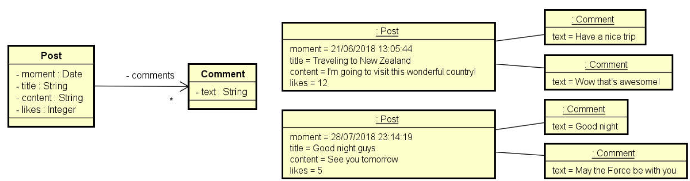

# Composição e String Builder

Exemplo Didático para explicação de Composição e String Builder em JAVA

Instancie manualmente (hard code) os objetos mostrados abaixo e mostre-os na tela do terminal, conforme exemplo.

